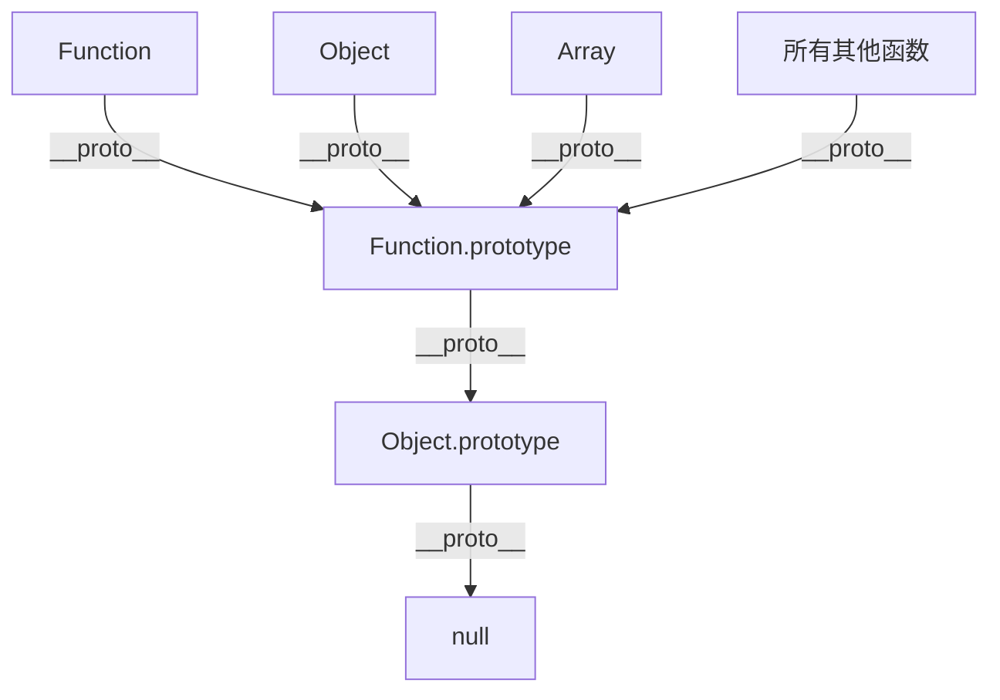
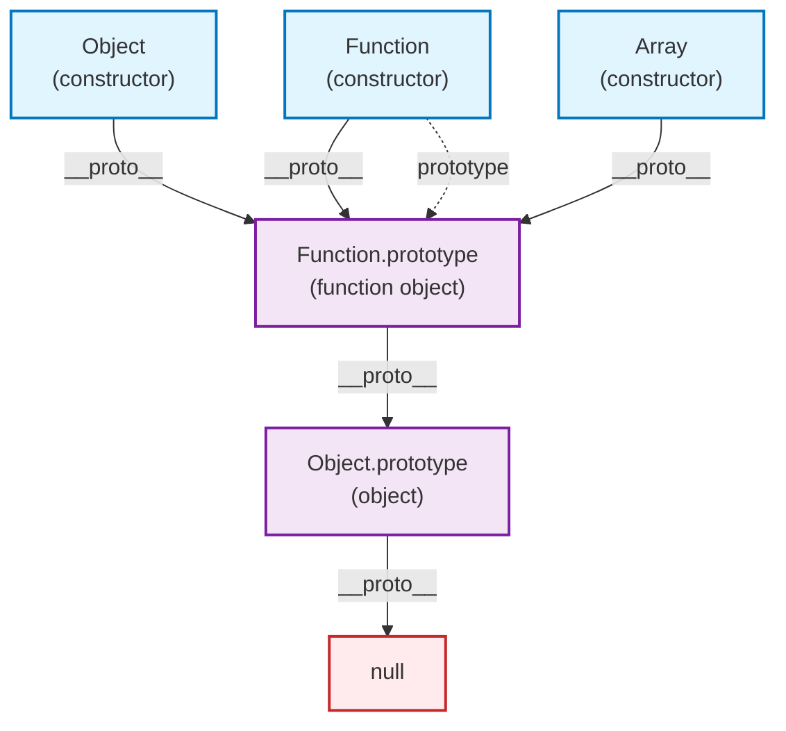

## 图表解读



这个图表揭示了 JavaScript 中最核心的原型链关系：**所有函数都是 Function 的实例，而 Function 本身也遵循原型链规则。**

## 核心概念

### 1. 原型链的本质

原型链是 JavaScript 实现继承的机制。每个对象都有一个内部属性 `[[Prototype]]`（通过 `__proto__` 访问），指向它的原型对象。

```javascript
// 基础示例
const obj = {};
console.log(obj.__proto__ === Object.prototype); // true
console.log(Object.prototype.__proto__ === null); // true
```

### 2. 函数的双重身份

**关键理解：函数既是对象，也是构造函数。**

```javascript
// Function 构造函数本身也是一个函数
console.log(typeof Function); // 'function'
console.log(Function instanceof Function); // true
console.log(Function instanceof Object); // true

// 验证 Function 的原型链
console.log(Function.__proto__ === Function.prototype); // true
console.log(Function.prototype.__proto__ === Object.prototype); // true
```

## 逐步分析图表

### 第一层：Function 的自指向 - 最特殊的关系

```javascript
// Function 构造函数指向 Function.prototype
console.log(Function.__proto__ === Function.prototype); // true

// 这是 JavaScript 中唯一的自指向关系
// Function 是唯一一个 __proto__ 指向自己 prototype 的对象
```


#### 🎯 自指关系的意义

```javascript
// 这种自指关系确保了：
// 1. Function 能够访问所有函数的通用方法
console.log(Function.call); // 来自 Function.prototype.call
console.log(Function.apply); // 来自 Function.prototype.apply

// 2. Function 遵循统一的原型链规则
console.log(Function.__proto__); // Function.prototype
console.log(Function.__proto__.__proto__); // Object.prototype
console.log(Function.__proto__.__proto__.__proto__); // null

// 3. instanceof 操作符正确工作
console.log(Function instanceof Function); // true
console.log(Function instanceof Object); // true
```

### 第二层：Function.prototype 作为所有函数的 " 基类 "

```javascript
// Function.prototype 指向 Object.prototype
console.log(Function.prototype.__proto__ === Object.prototype); // true

// Function.prototype 是一个特殊的空函数
console.log(Function.prototype); // ƒ () { [native code] }
console.log(typeof Function.prototype); // 'function'
```

#### 🏗️ Function.prototype 包含的核心属性和方法

```javascript
// 查看 Function.prototype 的所有属性
const methods = Object.getOwnPropertyNames(Function.prototype);
console.log(methods); 
// ['length', 'name', 'arguments', 'caller', 'constructor', 'apply', 'bind', 'call', 'toString']

// 核心方法：
console.log(Function.prototype.call);      // ƒ call() { [native code] }
console.log(Function.prototype.apply);     // ƒ apply() { [native code] }
console.log(Function.prototype.bind);      // ƒ bind() { [native code] }
console.log(Function.prototype.toString);  // ƒ toString() { [native code] }
```


**关键理解：** Function.prototype 就像是所有函数的 " 模板 "，定义了函数的基本能力（call、apply、bind 等），所有函数都从这里继承了这些核心方法。

### 第三层：Object.prototype 指向 null

```javascript
// 原型链的终点
console.log(Object.prototype.__proto__ === null); // true
```

这是原型链的顶端，`null` 表示原型链的结束。

### 其他函数的原型链

```javascript
// Object 构造函数
console.log(Object.__proto__ === Function.prototype); // true
console.log(typeof Object); // 'function'

// Array 构造函数
console.log(Array.__proto__ === Function.prototype); // true
console.log(typeof Array); // 'function'

// 自定义函数
function myFunction() {}
console.log(myFunction.__proto__ === Function.prototype); // true

// 箭头函数也一样
const arrowFunc = () => {};
console.log(arrowFunc.__proto__ === Function.prototype); // true
```


## 深度理解：constructor 属性

每个 `prototype` 对象都有一个 `constructor` 属性，指回构造函数：

```javascript
// constructor 属性的循环引用
console.log(Function.prototype.constructor === Function); // true
console.log(Object.prototype.constructor === Object); // true
console.log(Array.prototype.constructor === Array); // true

// 这形成了一个循环引用系统
// Function ↔ Function.prototype
// Object ↔ Object.prototype
// Array ↔ Array.prototype
```

## 实际应用场景

### 1. 理解 instanceof 运算符

```javascript
// instanceof 沿着原型链查找
console.log(Function instanceof Object); // true
// 因为 Function.__proto__.__proto__ === Object.prototype

console.log(Object instanceof Function); // true  
// 因为 Object.__proto__ === Function.prototype

console.log(Array instanceof Function); // true
console.log(Array instanceof Object); // true

// 自定义函数
function MyFunc() {}
console.log(MyFunc instanceof Function); // true
console.log(MyFunc instanceof Object); // true
```

### 2. 方法继承的原理

```javascript
// 所有函数都能调用 call, apply, bind
// 因为这些方法定义在 Function.prototype 上

function myFunc() {
  console.log('Hello');
}

// 这些方法来自 Function.prototype
console.log(myFunc.call === Function.prototype.call); // true
console.log(myFunc.apply === Function.prototype.apply); // true
console.log(myFunc.bind === Function.prototype.bind); // true

// 验证继承路径
console.log(myFunc.__proto__ === Function.prototype); // true
```

### 3. 原型污染攻击的原理

```javascript
// 危险示例：不要在生产环境中使用
// 通过原型链可以影响所有对象

// 污染 Object.prototype
Object.prototype.isHacked = true;

// 影响所有对象
const obj = {};
const arr = [];
const func = function() {};

console.log(obj.isHacked); // true
console.log(arr.isHacked); // true  
console.log(func.isHacked); // true

// 清理
delete Object.prototype.isHacked;
```

## 特殊情况和边缘案例

### 1. Function.prototype 的特殊性

```javascript
// Function.prototype 是唯一既是函数又是原型的对象
console.log(typeof Function.prototype); // 'function'
console.log(Function.prototype.length); // 0
console.log(Function.prototype.name); // ''

// 但它不能作为构造函数使用
try {
  new Function.prototype();
} catch (e) {
  console.log('Error:', e.message); // TypeError
}
```

### 2. 箭头函数的限制

```javascript
// 箭头函数没有 prototype 属性
const arrow = () => {};
console.log(arrow.prototype); // undefined

// 但仍然继承自 Function.prototype
console.log(arrow.__proto__ === Function.prototype); // true

// 不能作为构造函数
try {
  new arrow();
} catch (e) {
  console.log('Arrow function cannot be constructor'); 
}
```

## 原型链遍历算法

```javascript
// 手动实现原型链遍历
function tracePrototypeChain(obj, name = 'object') {
  console.log(`\n=== ${name} 的原型链 ===`);
  
  let current = obj;
  let level = 0;
  
  while (current !== null) {
    console.log(`Level ${level}:`, current.constructor?.name || 'null', current);
    current = Object.getPrototypeOf(current);
    level++;
    
    // 防止无限循环
    if (level > 10) break;
  }
}

// 测试不同对象的原型链
tracePrototypeChain(Function, 'Function');
tracePrototypeChain(Object, 'Object');
tracePrototypeChain(Array, 'Array');
tracePrototypeChain(function(){}, 'custom function');
tracePrototypeChain([], 'Array instance');
tracePrototypeChain({}, 'Object instance');
```

## 内存模型图解



**图表说明：**

- **蓝色框**：构造函数（Function、Object、Array 等）
- **紫色框**：原型对象（Function.prototype、Object.prototype）
- **红色框**：原型链终点（null）
- **实线箭头**：`__proto__` 关系（原型链）
- **虚线箭头**：`prototype` 属性关系

## 最佳实践与注意事项

### 1. 检查原型链

```javascript
// 安全的原型检查
function hasInPrototypeChain(obj, Constructor) {
  return obj instanceof Constructor;
}

// 更精确的检查
function isDirectInstanceOf(obj, Constructor) {
  return Object.getPrototypeOf(obj) === Constructor.prototype;
}

// 检查是否是某个原型的直接实例
console.log(isDirectInstanceOf({}, Object)); // true
console.log(isDirectInstanceOf([], Object)); // false
console.log(isDirectInstanceOf([], Array)); // true
```

### 2. 避免直接修改 `__proto__`

```javascript
// ❌ 不推荐：直接修改 __proto__
const obj = {};
obj.__proto__ = Array.prototype; // 性能差，兼容性问题

// ✅ 推荐：使用 Object.create
const betterObj = Object.create(Array.prototype);

// ✅ 或使用 Object.setPrototypeOf（但仍有性能考虑）
Object.setPrototypeOf(obj, Array.prototype);
```

### 3. 性能考虑

```javascript
// 原型链查找有性能成本
const deepObj = {};
let current = deepObj;

// 创建很长的原型链
for (let i = 0; i < 1000; i++) {
  const next = {};
  Object.setPrototypeOf(current, next);
  current = next;
}

// 访问不存在的属性会遍历整个原型链
console.time('prototype lookup');
for (let i = 0; i < 100000; i++) {
  deepObj.nonExistentProperty; // 会查找整个原型链
}
console.timeEnd('prototype lookup');
```

